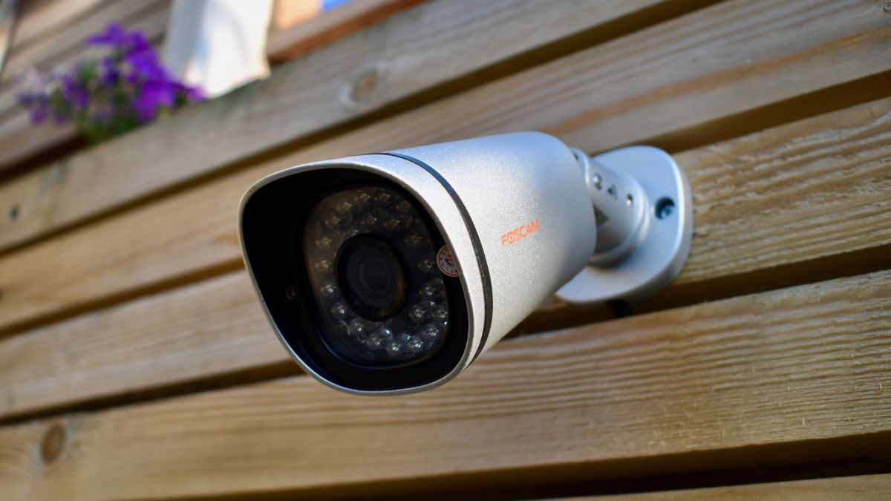
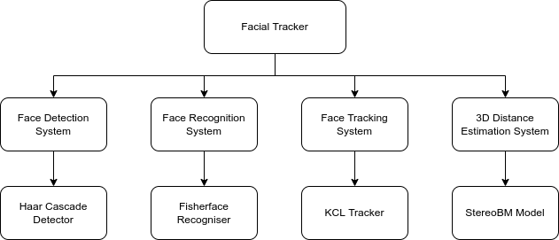
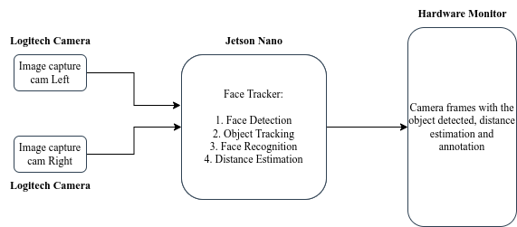
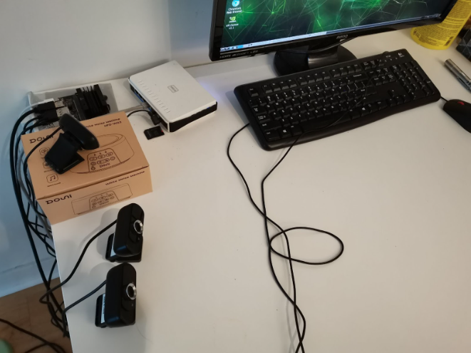
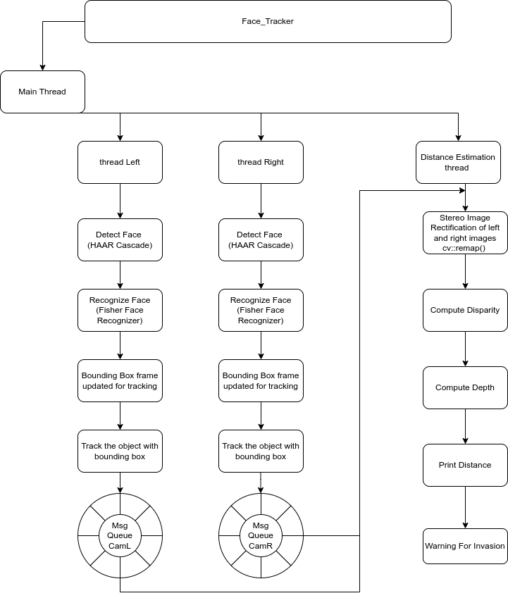
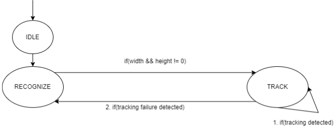
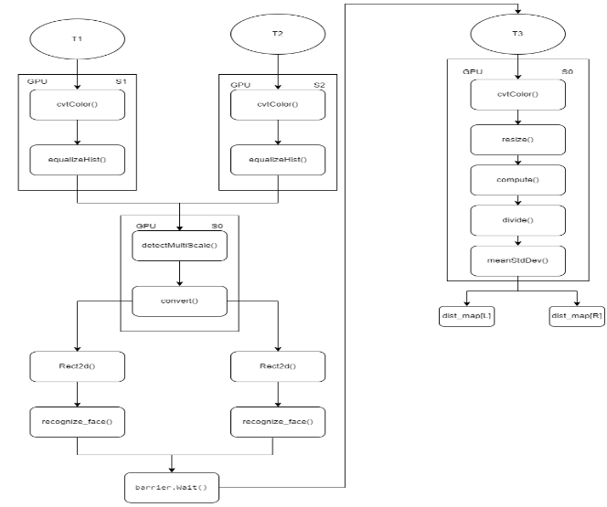

# Facial-Tracker



## Project Overview

As home security camera systems are excellent tools for home protection and are great applications of computer vision, `Facial Tracker` is developed as a home security system using computer vision technologies. `Facial Tracker` detects and recognizes strangers nearby the protected property, tracks the individuals continuously and warns the owner of the property when the stranger is too close to the property.

The system is composed of a facial detection subsystem, a facial recognition subsystem, a tracking subsystem and a distance estimation subsystem. Such composition is illustrated by the following block diagram: 



All four subsystems are interconnected via data flows. Specifically, the face detection subsystem, which is implemented using the Haar Cascade detector, detects individual faces from camera frames in real-time, and forwards the face data to the face recognition subsystem, which is implemented via the Fisherface recogniser model because of its capability of facial recognition. The recognition system annotates the detected individual and forwards the facial image information to the track subsystem, which is realized by the KCL tracker. The KCL tracker not only tracks the target but also delivers the target information to the distance estimation subsystem so that the StereoBM model can perform the distance estimation while the KCL tracker is tracking the target. 


## Project Requirements

The project is developed to meet the following functional requirements:

| Req No.  | Description |
| ------------- | ------------- |
| 1  | The system shall detect the objects/persons continuously.  |
| 2  | The system shall track the object of interest continuously.  |
| 3  | The system shall find the distance between the camera pair and the object of interest.  |
| 4  | The system shall annotate camera frames for facial recognition purposes.  |
| 5  | The system shall recognize faces for the individual under tracking.  |
| 6  | The system shall warn the user/owner of the property for the incoming threat if an invader is detected and close to the protected property.  |
| 7  | The system shall log information including fps for post processing purposes.  |
| 8  | The system shall utilize all CPU cores and the GPU core for performance boosting.  |


## Hardware Block Diagram

In terms of the system architecture, the system currently uses two cameras arranged in parallel to calculate the depth map and estimate the distance from the target to the camera pair. The video processing is performed on a Jetson Nano board and the processed camera frames are dumped to the attached monitor. The following diagram illustrates such logical architecture:




The actual in-house system setup can be shown in the following screenshots:




## Software Flow Diagram



As can be seen above, the main thread creates and initiates the other three threads. The left thread and the right thread essentially go through the same series of operations except that the left thread captures frames from the left camera and the right thread captures frames from the right camera. Whenever camera frames are successfully captured, the Haar Cascade classifier on both threads will be used for face detection, and then the fisherface models will try to recognize the detected faces. The facial recognition is based on the pre-trained data with the database of people to recognise as per the application. Upon the facial recognition, the KCF trackers will update the tracking and push the facial information to the concurrent message queues, which will be pulled by the distance estimation thread, which uses the StereoBM model for distance estimation. During the distance estimation process, the images are remapped for stereo image rectification. The disparity is computed via StereoBM model and  by using the formula:
``` 
depth = M * (1/disparity),
where M = 4.1320842742919922e+01
```
the depth is estimated and printed on the annotated frames.


## Finite State Machine Diagram



The entire system is composed of two states: the RECOGNIZE state and the TRACK state. The two threads that handle facial recognition and tracking run separately and go through both the RECOGNIZE state and the TRACK state during their lifetime, but the distance estimation thread only runs in the TRACK state. Specifically, the two threads initially reside in IDLE state but immediately move to the RECOGNIZE state for facial detection and recognition. Once a face is recognized, the thread is advanced to the TRACK state for the target tracking. The distance estimation is only possible to be performed when the both facial recognition threads are in the TRACK state.  


## Optimization

The project implementation is optimized via CUDA programming by leverage the NVIDIA GPU provided by the Jetson Nano. Particularly, the facial detection and distance estimation are offloaded to the GPU rather than CPU cores. The following diagram illustates the use of GPU in detail:



T1,T2 and T3 denote threads in use, and label `Sx` indicates the CUDA stream `x` in use for the speicified operation. It can be seen above that T1 and T2 share the GPU device for facial detection and the entire distance estimation feature is executed on the GPU stream 0. Such implementation change frees one CPU core for extra work.


## Dependency Installation & Compiltation

The project is built on top of `Opencv4.5` and a custom OpenCV-Contrib module called `2048_cuda_cascade_no_longer_available` and the development board is the Jetson Nano. Users need to install both OpenCV4.5 and the OpenCV-Contrib module by running the following script in root:
```
sudo ./install_opencv.sh
```

Upon the installation of the modules, users need to run the following commands to build the executable:
```
cd code
mkdir build && cd build
cmake ..
make
./face_tracker
```


## Demo

The following video briefly demonstrate the work of the executable:

[](./demo.mp4)